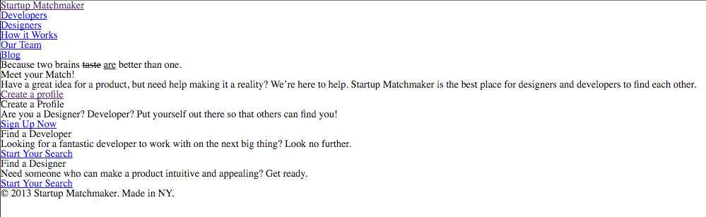

### **<u>Startup Matchmaker Lab</u>**

#### **If you want some guidance, here are some suggested steps to follow** and some very rough estimates of how long it may take 

*(the time to do these steps can, and **likely will** vary greatly.  This is meant to be challenging (especially for Unit 3)  Don't worry if it takes you shorter or longer - the estimates are mainly there to help you see the process broken down into manageable chunks )*


The goal for this project/lab is to:

- accurately represent the design file using HTML/CSS
- track your development using the GitHub desktop app

**<u>Step 1</u>**


**Setup files/folders** 

>
>*est. time to complete - ~10 - 20 mins*

1. Create a new repo on GitHub called `startup-matchmaker`

2. Clone this repository to your `workspace/Week_03_Layout/06_HTML_CSS_Practice` folder

3. Copy/paste the contents (not the folder) of the `sm_starter` folder into your newly created folder

4. Make your first commit in GitHub "starter code added")

5. Create a  `css` folder in your `startup-matchmaker/` folder

6. Download  or link to `reset.css` found at http://www.jsdelivr.com/projects/meyer-reset

   1. if you download it, place the file in your `css/` folder

7. Create `style.css` file and put it in `css/`folder

8. Create an `index.html` file in `startup_matchmaker/` , setup the HTML5 structure (DOCTYPE, HEAD, etc.) and link both of the above `.css` files into your `index.html` file

   ​


**COMMIT POINT** - **Save before you commit!**


e.g. "adds html/css files for site"

**<u>Step 2</u>**

**Brainstorm/Wireframe**

> *est. time to complete - ~20 mins*

- Find space on a wall or desk and reverse-engineer the design file into a wireframe
- Using the HTML5 element handout, label the sectioning components of the wireframe (header, footer, nav, aside, section, div)
- After these blocks have been labeled, then add inline elements like (nav links, buttons, text etc.)


**<u>Step 3</u>**

**Create the skeleton in your HTML**

>*est. time to complete: ~ 15-30 mins*

- Open up the `index.html` file you created at the beginning
- Using your wireframe as a reference, in the `<body>` of your `index.html` file, write out the HTML elements you chose
  - work from top to bottom
  - don't worry about adding the text/content in at this point
- Once you have your tags in your document, go ahead and add the content/words into the appropriate elements (e.g. "because two brains ….")

At this point, in your browser, the site will still look something like this: 



**COMMIT POINT** - **Save before you commit!**


e.g. "adds html tags to index.html"


**<u>Step 4</u>**
**Design/Style**


**<u>4a)</u> *Setting up environment***


> *est. time to complete ~15-20 mins*

- Open up the design file and review the design specs below
- Since we know we will need Google fonts, go ahead and [create the collection](https://www.google.com/fonts) you will need and bring it into your file
- Here are the Google fonts (and styles) you will need:
  - `Merriweather: 700, 700 italics`
  - `Oswald 700`:
  - `Source Sans Pro: 400,700`


**COMMIT POINT** - **Save before you commit!****


e.g. "adds google fonts"


**<u>4b)</u>** Begin CSS Skeleton***


> *est. time to complete - 15-30 mins*

The goal of this step is to provide yourself with empty css rules that correspond to markup you have just created *(If you notice places you will need IDs and Classes, make a note of them as they will be used in the next step)*

1.   Utilize Atom's split-view, open your `index.hml` file in one and `style.css` in another (ask if you need help with this)

2.   Referencing your markup, begin the skeleton of **empty** CSS rules you will need in your style sheet
     1.  begin by laying out css rules for each element that appears in your `index.html` file like this:

```
header {

}

header nav {

}
```

**COMMIT POINT** - **Save before you commit!****


e.g. "adds css selectors for elements"


**<u>4c</u>**: Assign IDs & Classes to markup, and create a skeleton for them in `style .css`


> *est. time to complete ~ 20 mins*
>  This step in the process is about identifying the **similarities** and differences in the **way** elements are laid out and styled.  **We are not styling the elements in this step.**  We are simply **identifying** the need for and **assigning** IDs and Classes to our markup, as well as creating the corresponding empty CSS rules.  This is to put us in a position so that we will be able to **uniquely** and **efficiently** style these similarities and differences in the next step.  


>
>**Common questions/thought patterns to have during this time:** 
>
>
>*Do I need to be able to set the width of this element or group of elements?  If so, can I do that using the element selector or will that target another element on the page I don't want to?  If yes, then I should assign it an ID so I can uniquely target it*
>
>
>*What elements look the same on this page?  Oh…these all have the same dimensions.  I could assign them all to the same class and use that class to set their dimensions and font style.  Oh, and maybe I could use float or inline-block to align them how I want.*


i) as you encounter elements you want to be able to uniquely identify, assign an ID to it in the html, and create an empty rule in the CSS using the #id as a selector 


*For example, if I realize I have two <header> elements in my markup, and I want to style them differently (perhaps they should have different widths) I could decide to identify the first one like this:
```    
/* IN CSSS */

#primary-header {

}

<!-- in HTML -->
...
....
<header id="primary-header">
</header>
...
...
```
and the second one like this
```    
/* IN CSSS */

#secondary-header {

}

<!-- in HTML -->
...
....
<header id="secondary-header">
</header>
...
...
```
ii) As you ecounter multiple elements that have **at least some** things in common, assign a class to the element(s) and create that empty .class rule in your css


iii) COMMIT POINT **Save before you commit!**
 e.g. "adds IDs and Classes to markup and uses them as as selectors in CSS"


**<u>4d)</u>** Adding style!

> *est. time to complete ~ 60-90 mins*

Now is the time to enjoy putting all of your planning and structuring to use!

1. Starting with the font specs below, begin filling in your CSS rules
2. After the fonts from below, begin at the top of your CSS rules, and begin working your way down

Things to keep in mind during this step:

- Can I easily represent the width of this element in % ?  (especially with big elements in terms of layout)

- Can I utilize inheritence so that the font style and color are inherited by the children of this particular element?


**COMMIT POINT** - **Save before you commit!**

Commit throughout this process


e.g. "styles header"

e.g. "styles sidebar"

e.g. "styles boxes"


------
### FONT SPECS

Body - Source Sans Pro
H1, H3 - Merriweather
Butons - Oswald
Nav - Oswald
“Because two brains…” - Merriweather
